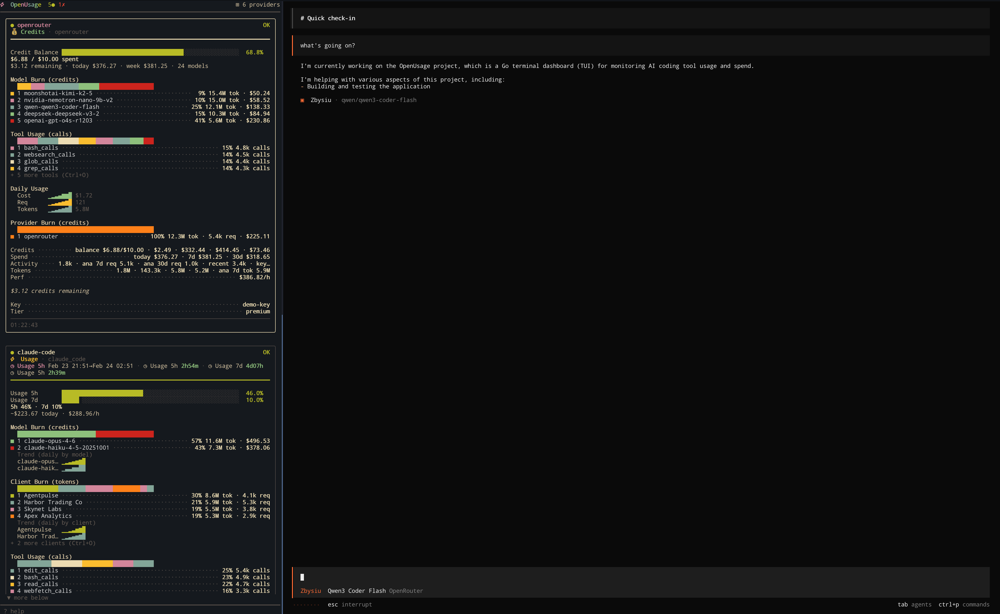

# openusage

A terminal dashboard for monitoring AI coding tool usage and spend — all in one place.

OpenUsage auto-detects the AI tools and API keys on your workstation and displays live usage snapshots in a [Bubble Tea](https://github.com/charmbracelet/bubbletea) TUI with dashboard, list, and analytics views. Six built-in color themes keep it looking good in any terminal.


Or side by side with your agent



## Supported Providers

OpenUsage ships with 13 provider adapters covering API services, local IDEs, and CLI tools.

| Provider | Method | Metrics |
|---|---|---|
| **OpenAI** | API header probing | RPM, TPM, RPD usage windows |
| **Anthropic** | API header probing | RPM, TPM usage windows |
| **OpenRouter** | REST API | Credits, spend, per-model generation stats |
| **Groq** | API header probing | RPM, TPM, RPD, TPD usage windows |
| **Mistral** | REST API | Subscription info, usage, usage windows |
| **DeepSeek** | REST API | Balance, usage windows |
| **xAI (Grok)** | REST API | Balance, usage windows |
| **Gemini API** | REST API | Model token limits, usage remaining |
| **Gemini CLI** | Local files + OAuth API | CodeAssist usage buckets, conversation counts |
| **GitHub Copilot** | `gh` CLI + API | Seat count, org billing, usage metrics, session state |
| **Cursor IDE** | DashboardService API + local SQLite | Spend limit, plan usage, per-model stats, daily activity |
| **Claude Code** | Local files | Daily cost, burn rate, billing blocks, messages, sessions |
| **OpenAI Codex CLI** | Session files | Usage windows, token usage, session counts |

## Installation

### Homebrew (macOS / Linux)

```bash
brew install janekbaraniewski/tap/openusage
```

### From source

Requires Go 1.25+ and a C compiler (CGO is needed for the Cursor provider's SQLite support).

```bash
go install github.com/janekbaraniewski/openusage/cmd/openusage@latest
```

### From release binaries

Pre-built binaries are available for macOS (amd64, arm64), Linux (amd64, arm64), and Windows (amd64). Download the archive for your platform from [Releases](https://github.com/janekbaraniewski/openusage/releases), extract it, and place `openusage` somewhere on your `PATH`.

### Build locally

```bash
git clone https://github.com/janekbaraniewski/openusage.git
cd openusage
make build          # binary appears in ./bin/openusage
```

> **Note:** Building from source requires CGO enabled (`CGO_ENABLED=1`) and a working C compiler, because the Cursor provider reads local SQLite databases via `mattn/go-sqlite3`.

## Quick Start

Just run:

```bash
openusage
```

With **auto-detection enabled** (the default), OpenUsage scans for:

- **Cursor IDE** — reads local AI tracking databases and calls the DashboardService API
- **Claude Code CLI** — reads `~/.claude/stats-cache.json`, account info, and conversation logs
- **OpenAI Codex CLI** — reads session usage windows and token usage from `~/.codex/sessions/`
- **GitHub Copilot** — via the `gh` CLI extension (checks that `gh copilot` is installed)
- **Gemini CLI** — reads `~/.gemini/` config files and refreshes OAuth tokens for usage data
- **Aider CLI** — detected on PATH (delegates to underlying API providers)
- **Environment variables** — `OPENAI_API_KEY`, `ANTHROPIC_API_KEY`, `OPENROUTER_API_KEY`, `GROQ_API_KEY`, `MISTRAL_API_KEY`, `DEEPSEEK_API_KEY`, `XAI_API_KEY`, `GEMINI_API_KEY`, `GOOGLE_API_KEY`

If any of the above are present, OpenUsage will immediately start displaying live data.

## Configuration

Config file location: `~/.config/openusage/settings.json`

```json
{
  "auto_detect": true,
  "ui": {
    "refresh_interval_seconds": 30,
    "warn_threshold": 0.2,
    "crit_threshold": 0.05
  },
  "accounts": [
    {
      "id": "openai-personal",
      "provider": "openai",
      "api_key_env": "OPENAI_API_KEY",
      "probe_model": "gpt-4.1-mini"
    },
    {
      "id": "anthropic-work",
      "provider": "anthropic",
      "api_key_env": "ANTHROPIC_API_KEY"
    }
  ]
}
```

See [`configs/example_settings.json`](configs/example_settings.json) for a full reference with all providers.

Auto-detected accounts are merged with manually configured ones — configured accounts take precedence.

## TUI Navigation

OpenUsage has three screens, cycled with `Tab` / `Shift+Tab`:

| Screen | Description |
|---|---|
| **Dashboard** | Tile grid overview of all providers |
| **List** | Master-detail list with scrollable, tabbed detail panel |
| **Analytics** | Spend analysis with five sub-tabs: Overview, Providers, Models, Budget, Efficiency |

### Keyboard Shortcuts

| Key | Action |
|---|---|
| `Tab` / `Shift+Tab` | Switch screen |
| `↑` `↓` `←` `→` / `h` `j` `k` `l` | Navigate |
| `Enter` | Open detail view |
| `Esc` / `Backspace` | Back to list |
| `/` | Filter providers |
| `[` `]` | Cycle detail/analytics tabs |
| `g` / `G` | Jump to top / bottom |
| `t` | Cycle color theme |
| `r` | Manual refresh |
| `?` | Help overlay |
| `q` | Quit |

**Analytics-specific:**

| Key | Action |
|---|---|
| `o` `p` `m` `b` `e` | Jump to Overview / Providers / Models / Budget / Efficiency |
| `s` | Cycle sort order |

### Themes

Six built-in themes, cycled with `t`:

Catppuccin Mocha · Dracula · Nord · Tokyo Night · Gruvbox · Synthwave '84

## Environment Variables

| Variable | Purpose |
|---|---|
| `OPENUSAGE_DEBUG` | Set to `1` to enable debug logging to stderr |

## Development

```bash
make help           # list all targets
make deps           # download and verify dependencies
make fmt            # format code
make vet            # run go vet
make lint           # run golangci-lint (skips if not installed)
make test           # run tests with race detection and coverage
make test-verbose   # verbose test output
make run            # run the app locally
make build          # build binary to ./bin/
make clean          # remove build artifacts
```

## Architecture

```
main.go → config.Load() → detect.AutoDetect() → core.NewEngine()
  → registers providers from providers.AllProviders()
  → engine.Run() polls all accounts concurrently on a ticker
  → snapshots sent to TUI via tea.Program.Send()
  → tui.Model renders Dashboard / List / Analytics
```

Every provider implements the `QuotaProvider` interface:

```go
type QuotaProvider interface {
    ID() string
    Describe() ProviderInfo
    Fetch(ctx context.Context, acct AccountConfig) (QuotaSnapshot, error)
}
```

Providers fall into four patterns:

- **HTTP header probing** — lightweight API request, parse rate-limit headers (OpenAI, Anthropic, Groq, Mistral, DeepSeek, xAI, Gemini API)
- **Rich REST API** — multiple endpoint calls for credits, billing, and generation stats (OpenRouter, Cursor)
- **Local file readers** — parse stats files, session logs, and conversation data (Claude Code, Codex, Gemini CLI)
- **CLI subprocess** — shell out to `gh` CLI commands (Copilot)

## Project Structure

```
cmd/openusage/         CLI entry point
internal/
  config/               JSON config loading & defaults
  core/                 Engine, provider interface, snapshot types
  detect/               Auto-detection of tools & API keys
  parsers/              Shared rate-limit header parsing helpers
  providers/            Provider adapters (one package per vendor)
    anthropic/          Anthropic API header probing
    claude_code/        Claude Code local stats & billing blocks
    codex/              OpenAI Codex CLI session file reader
    copilot/            GitHub Copilot via gh CLI
    cursor/             Cursor IDE API + local SQLite fallback
    deepseek/           DeepSeek balance + usage windows
    gemini_api/         Google Gemini API usage probing
    gemini_cli/         Gemini CLI local config + OAuth usage API
    groq/               Groq API header probing
    mistral/            Mistral subscription + usage API
    openai/             OpenAI API header probing
    openrouter/         OpenRouter credits + generation stats
    xai/                xAI balance + usage windows
  tui/                  Bubble Tea UI (views, themes, charts, gauges)
  version/              Build-time version metadata (ldflags)
configs/                Example configuration file
```

## License

MIT — see [LICENSE](LICENSE) for details.
