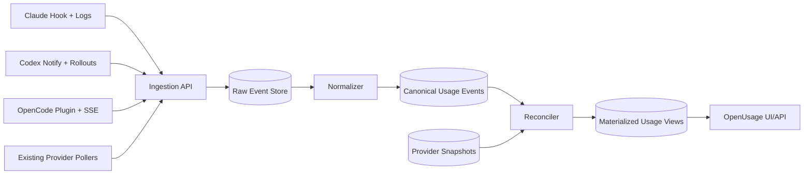

# Unified Agent Usage Tracking Design (Claude Code, Codex, OpenCode)

## Status
- Version: v1.0 (self-reviewed, execution-ready)
- Date: 2026-02-22
- Authors: OpenUsage

## 1. Problem Statement
OpenUsage currently polls provider APIs and local files for periodic snapshots. That works for limits/balances, but it is not enough to produce always-accurate per-prompt/per-response usage across coding agents.

We need a unified event pipeline that can ingest prompt/response/tool metrics from:
- Claude Code
- Codex
- OpenCode

Then aggregate, deduplicate, normalize, and reconcile into one canonical usage ledger.

## 2. Goals
1. Capture per-turn (and where possible per-tool-call) usage reliably.
2. Deduplicate events across multiple sources (hooks, logs, APIs).
3. Normalize models/providers into canonical dimensions.
4. Reconcile to billing/limits endpoints to keep reported totals accurate.
5. Keep a full audit trail of raw inputs and normalization/reconciliation decisions.

## 3. Non-Goals
1. Replacing all existing OpenUsage provider snapshot adapters immediately.
2. Building a generic analytics warehouse for arbitrary events beyond usage.

## 4. Constraints and Source Reality

### Claude Code
- Existing OpenUsage adapter reads local JSONL and stats cache, plus a usage endpoint.
- Local costs are explicitly estimates in current implementation.
- Hook system exists and can execute scripts with contextual payloads.

Implication:
- Use hook events + transcript-derived usage as primary per-turn source.
- Use usage endpoint for quota/reconciliation windows, not as sole event source.

### Codex
- Existing OpenUsage adapter combines local sessions JSONL + live usage endpoint.
- Live usage endpoint provides limits/credits metadata, not full per-turn token usage.
- `notify` hook is configurable and receives per-turn completion payload.
- Internal core has richer hook event shapes (after_agent, after_tool_use), but user-facing stable config currently exposes `notify`.

Implication:
- Use notify payload as turn boundary signal.
- Parse rollout/session JSONL as usage source.
- Treat live usage endpoint as reconciliation/limits source.

### OpenCode
- Plugin hooks and server event streams are first-class.
- Event schema includes message/session updates with cost/tokens.

Implication:
- Use plugin hook and/or SSE as first-class event ingestion.
- OpenCode can provide the cleanest event-native integration.

## 5. High-Level Architecture

### Components
1. **Collector adapters** (agent-specific emitters/parsers).
2. **Ingestion API** (idempotent append-only writes).
3. **Raw event store** (immutable, schema-versioned payloads).
4. **Normalization pipeline** (common event shape + canonical model IDs).
5. **Reconciler** (align event totals with provider authoritative windows).
6. **Serving layer** (daily/weekly/all-time by provider/account/model/project/tool).

## 5.1 Ingestion API Contract (MVP)
Endpoint:
- `POST /v1/usage/events`

Request fields:
- `source_system`
- `source_channel`
- `source_schema_version`
- `occurred_at`
- `workspace_id` (optional)
- `session_id` (optional)
- `turn_id` (optional)
- `message_id` (optional)
- `tool_call_id` (optional)
- `provider_id` (optional)
- `account_id` (optional)
- `payload` (opaque json object)

Response:
- `200 OK` with `{ "status": "accepted", "deduped": false, "event_id": "<uuid>" }`
- `200 OK` with `{ "status": "accepted", "deduped": true, "event_id": "<existing_uuid>" }`
- `400` for schema-invalid payload
- `401/403` for auth failures

Idempotency:
- Server computes `dedup_key`.
- Unique index on `usage_events.dedup_key`.
- Duplicate submits return `deduped: true`.

## 6. Canonical Data Model

## 6.1 Raw Event Table
`usage_raw_events`
- `raw_event_id` (UUID PK)
- `ingested_at` (timestamp)
- `source_system` (enum: `claude_code`, `codex`, `opencode`, `provider_poller`)
- `source_channel` (enum: `hook`, `sse`, `jsonl`, `api`)
- `source_schema_version` (string)
- `source_payload` (jsonb, encrypted-at-rest)
- `source_payload_hash` (sha256)
- `workspace_id` (string nullable)
- `agent_session_id` (string nullable)

Notes:
- Immutable; never updated.
- Keeps exact source for replay and forensic diff.

## 6.2 Canonical Event Table
`usage_events`
- `event_id` (UUID PK)
- `occurred_at` (timestamp, source event time)
- `provider_id` (string)
- `agent_name` (enum/string)
- `account_id` (string nullable)
- `workspace_id` (string nullable)
- `session_id` (string nullable)
- `turn_id` (string nullable)
- `message_id` (string nullable)
- `tool_call_id` (string nullable)
- `event_type` (enum: `turn_completed`, `message_usage`, `tool_usage`, `limit_snapshot`, `reconcile_adjustment`)
- `model_raw` (string nullable)
- `model_canonical` (string nullable)
- `model_lineage_id` (string nullable)
- `input_tokens` (bigint nullable)
- `output_tokens` (bigint nullable)
- `reasoning_tokens` (bigint nullable)
- `cache_read_tokens` (bigint nullable)
- `cache_write_tokens` (bigint nullable)
- `total_tokens` (bigint nullable)
- `cost_usd` (numeric(18,6) nullable)
- `requests` (int nullable)
- `tool_name` (string nullable)
- `status` (enum: `ok`, `error`, `aborted`, `unknown`)
- `dedup_key` (string unique)
- `raw_event_id` (FK -> usage_raw_events)
- `normalization_version` (string)

## 6.3 Reconciliation Table
`usage_reconciliation_windows`
- `recon_id` (UUID PK)
- `provider_id`, `account_id`
- `window_start`, `window_end`
- `authoritative_cost_usd` / `authoritative_tokens` / `authoritative_requests`
- `event_sum_cost_usd` / `event_sum_tokens` / `event_sum_requests`
- `delta_cost_usd` / `delta_tokens` / `delta_requests`
- `resolution` (enum: `none`, `event_adjustment_inserted`, `flag_only`)
- `created_at`

## 6.4 Materialized Views
- `usage_daily_by_provider`
- `usage_daily_by_model`
- `usage_daily_by_workspace`
- `usage_daily_by_tool`
- `usage_current_limits`

## 7. Deduplication Strategy

## 7.1 Dedup Key Construction
`dedup_key = sha256(agent + provider + account + session + turn + message + tool_call + event_type + occurred_at_bucket + token_tuple + cost_tuple)`

Where:
- `occurred_at_bucket`: RFC3339 or ms epoch (source-dependent).
- `token_tuple`: `(input, output, reasoning, cache_read, cache_write, total)`.
- `cost_tuple`: `(cost_usd, requests)`.

## 7.2 Priority of Stable IDs
When available, these dominate key construction:
1. `tool_call_id`
2. `message_id`
3. `turn_id`
4. fallback fingerprint (timestamp + token/cost tuple + model)

## 7.3 Source Priority (same logical event)
1. Agent-native event payload with explicit usage fields.
2. Agent transcript/log usage payload.
3. Derived/estimated metrics.

On conflict:
- Keep all raw events.
- Keep one canonical winner row (`status=ok`).
- Mark losers as superseded in normalization metadata (not deleted).

## 8. Normalization Rules
1. Reuse existing OpenUsage model canonicalization logic and confidence semantics.
2. Normalize token components into full tuple; infer `total_tokens` when missing.
3. Normalize cost currency to USD (or mark unsupported currencies explicitly).
4. Standardize workspace/project dimensions from path/cwd/session metadata.

## 9. Accuracy and Reconciliation

## 9.1 Accuracy Definition
For each provider/account/window:
- If authoritative provider totals are available, reported totals must match authoritative totals after reconciliation.
- If not available, reported totals are event-derived and explicitly labeled as such.

## 9.2 Reconciliation Flow
1. Collect authoritative snapshots (limits/usage endpoints).
2. Aggregate canonical usage events per matching window.
3. Compute delta.
4. If delta within tolerance: no action.
5. If delta exceeds tolerance:
   - insert `reconcile_adjustment` canonical event,
   - attach reason and source snapshot references.
6. Surface reconciliation health in diagnostics.

## 9.3 Tolerance Defaults
- Tokens: max(1%, 200 tokens)
- Cost: max(1%, $0.05)
- Requests: max(1%, 3 requests)

## 10. Agent Integration Design

## 10.1 Claude Code Adapter
Inputs:
- Hook payload events.
- Transcript/project JSONL entries.
- Existing usage API windows.

Implementation:
1. Install/update hook script during onboarding.
2. Hook emits lightweight event envelope to local spool.
3. Ingestor tails spool and transcript files for token/cost fields.
4. Build canonical `message_usage` + `tool_usage` + `turn_completed` rows.
5. Use usage API for reconciliation windows.

Fallback:
- If hooks disabled, continue file-based parser only.

Collector artifact:
- `scripts/telemetry/claude_hook.sh` (reads hook payload, writes local spool JSONL).

## 10.2 Codex Adapter
Inputs:
- `notify` payload on turn completion.
- Session/rollout JSONL for token_count and tool events.
- Live usage endpoint (`/wham/usage` or `/api/codex/usage`) for limits/credits.

Implementation:
1. Configure `notify` command to send payload to local collector.
2. Link notify payload to nearest rollout turn by `turn_id`/time.
3. Parse `token_count` deltas and tool events from rollout/session logs.
4. Emit canonical rows.
5. Reconcile against live usage windows.

Fallback:
- If notify missing, parse logs only.

Collector artifact:
- `scripts/telemetry/codex_notify.sh` configured in `~/.codex/config.toml` `notify`.

## 10.3 OpenCode Adapter
Inputs:
- Plugin hooks (`chat.message`, `tool.execute.after`, optional others).
- SSE `/event` stream for message/session updates.

Implementation:
1. Ship OpenCode plugin template for collector emission.
2. In collector, optionally subscribe to `/event` as secondary channel.
3. Use `message.updated` with assistant usage as canonical per-message source.
4. Dedup plugin-vs-SSE duplicates via stable IDs.

Fallback:
- SSE only mode where plugin install is not possible.

Collector artifacts:
- `plugins/openusage-telemetry` for hook emission.
- Optional SSE subscriber process for `/event`.

## 10.4 Adapter Spool Format
All local adapters write append-only JSONL records to:
- `${XDG_STATE_HOME:-~/.local/state}/openusage/telemetry-spool/*.jsonl`

Spool record shape:
- `spool_id` (uuid)
- `created_at`
- `source_system`
- `source_channel`
- `payload`
- `attempt` (int)
- `last_error` (optional)

Delivery worker behavior:
1. Read oldest-first.
2. Submit to ingestion API.
3. On success, mark record committed (or move to compacted archive).
4. On failure, exponential backoff with jitter.

## 11. Security and Privacy
1. Never persist raw prompt text by default in canonical tables.
2. Store raw payload encrypted; restrict access to admins.
3. Hash sensitive identifiers where not needed for joins.
4. Redact API keys/cookies/tokens at ingest boundary.
5. Provide retention policy (default raw: 30 days, canonical aggregates: long-term).

## 12. Reliability and Operations
1. Local durable spool (append-only file queue) for offline tolerance.
2. At-least-once delivery from adapters to ingestion API.
3. Idempotent ingest via unique `dedup_key`.
4. Dead-letter queue for malformed payloads.
5. Replay job from `usage_raw_events` for parser upgrades.
6. Metrics:
   - ingest lag,
   - dedup rate,
   - parse failure rate,
   - reconciliation delta rate,
   - per-adapter drop rate.

## 13. Rollout Plan

### Phase 0: Foundation
- Resolve OpenCode provider mapping mismatch (`OPENCODE_API_KEY` detection must map to a registered provider adapter).
- Add schema and ingestion endpoint.
- Add raw/canonical tables and dedup constraints.
- Add normalization library package.
- Add local spool + delivery worker.

### Phase 1: OpenCode First
- Implement plugin + SSE adapters.
- Validate end-to-end accuracy on controlled test sessions.

### Phase 2: Codex
- Implement notify + rollout parser correlation.
- Reconcile against live usage endpoint.

### Phase 3: Claude Code
- Implement hook + transcript ingestion.
- Reconcile against usage API windows.

### Phase 4: UI Integration
- Add event-derived accuracy indicators and reconciliation status.
- Preserve existing snapshot tiles as compatibility mode.

### Phase 5: Hardening
- Add replay, dead-letter tooling, migration scripts, and SLO dashboards.

## 13.1 Proposed Timeline
- Week 1: Phase 0.
- Week 2: Phase 1.
- Week 3: Phase 2.
- Week 4: Phase 3.
- Week 5: Phase 4.
- Week 6: Phase 5.

## 14. Testing Strategy
1. Golden payload fixtures per agent/channel.
2. Deterministic dedup tests across duplicated source inputs.
3. Reconciliation tests with synthetic drift.
4. Integration tests with local fake emitters and spool replay.
5. Backward compatibility tests with existing `UsageSnapshot` consumption.

## 15. Migration in OpenUsage Repo
1. Keep current providers working.
2. Introduce new internal package: `internal/telemetry` for event ingestion/normalization/reconciliation.
3. Add optional bridge from canonical aggregates to `UsageSnapshot` for existing TUI views.
4. Gradually switch provider widgets to canonical backing source.

## 16. Risks and Mitigations
1. **Upstream schema changes**
   - Mitigation: schema versioning + tolerant decoders + replay.
2. **Hook not configured by user**
   - Mitigation: fallback log/SSE parser + setup diagnostics.
3. **Double counting from mixed channels**
   - Mitigation: strict dedup key strategy + source priority rules.
4. **Estimated vs authoritative mismatch**
   - Mitigation: reconciliation windows + explicit labeling.

## 17. Decisions to Proceed Now (No Blockers)
1. Ingestion runs as local daemon first (`openusage-agent`) with optional remote forwarding later.
2. Default retention is `raw=30d`, `canonical=400d`, `daily_aggregates=unlimited`.
3. Prompt text storage is disabled by default and only available by explicit opt-in config.
4. Reconciliation source of truth is provider authoritative usage/billing endpoints when available; otherwise totals are event-derived and labeled `estimated`.
5. Raw payload encryption-at-rest is required whenever prompt text storage is enabled.

## 17.1 MVP Acceptance Criteria
1. OpenCode: per-message tokens and cost appear in canonical events, and duplicate plugin+SSE events do not double count.
2. Codex: notify+rollout correlation yields per-turn token totals, and live usage reconciliation stays within tolerance for at least 95% of windows.
3. Claude Code: hook+transcript ingestion produces per-turn token usage, and any estimated cost is visibly labeled with reconciliation status.
4. System: replay from raw events deterministically reproduces canonical events, and ingest error rate stays below 0.5% over 24h in test environment.

## 18. Self-Review Iterations

### Iteration 1 Remarks
- Needed stronger separation between immutable raw events and canonical rows.
- Dedup key needed explicit stable-ID priority.
- Reconciliation policy needed quantitative tolerances.

Applied changes:
- Added `usage_raw_events` and `usage_reconciliation_windows`.
- Added stable-ID priority and dedup key spec.
- Added default token/cost/request tolerances.

### Iteration 2 Remarks
- Agent sections were too high-level and did not specify fallback modes.
- Rollout plan lacked sequencing rationale.

Applied changes:
- Added per-agent fallback behavior.
- Expanded phased rollout with OpenCode-first, then Codex, then Claude.

### Iteration 3 Remarks
- Security posture around raw payloads needed explicit defaults.
- Migration plan to existing `UsageSnapshot` not explicit enough.

Applied changes:
- Added encryption, redaction, retention defaults.
- Added compatibility bridge plan to existing TUI snapshot model.

### Iteration 4 Remarks
- Open blockers remained in section 17.
- No explicit MVP API contract.
- Done criteria were not measurable.

Applied changes:
- Replaced blockers with concrete default decisions.
- Added ingestion API contract and idempotency behavior.
- Added MVP acceptance criteria and timeline.

### Iteration 5 Final Check
Remaining remarks: **none**.

## 19. Implementation Kickoff (Next Actionable Tasks)
1. Fix OpenCode provider registration/detection mismatch so `OPENCODE_API_KEY` resolves to a registered provider.
2. Create schema migrations for `usage_raw_events`, `usage_events`, `usage_reconciliation_windows`.
3. Implement `internal/telemetry/ingest` with idempotent insert by `dedup_key`.
4. Implement OpenCode adapter first (plugin + SSE).
5. Add reconciliation worker against existing provider snapshot pollers.
6. Expose aggregated telemetry through a small internal query API for TUI integration.
