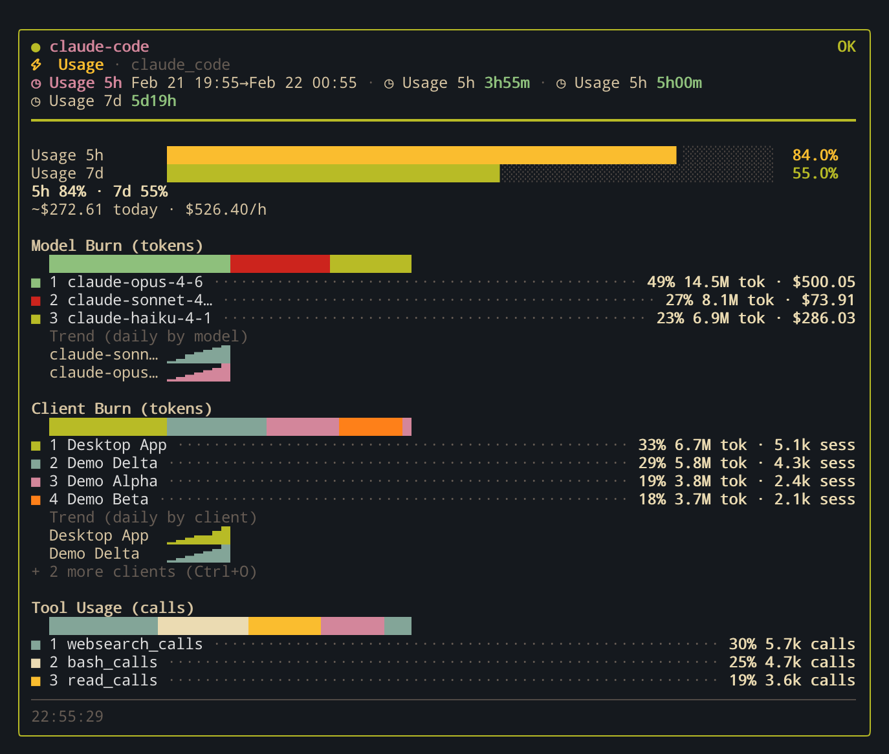
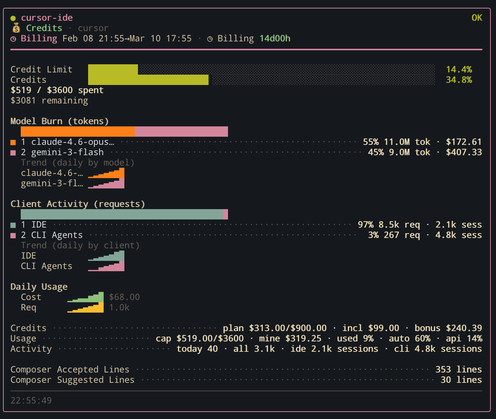
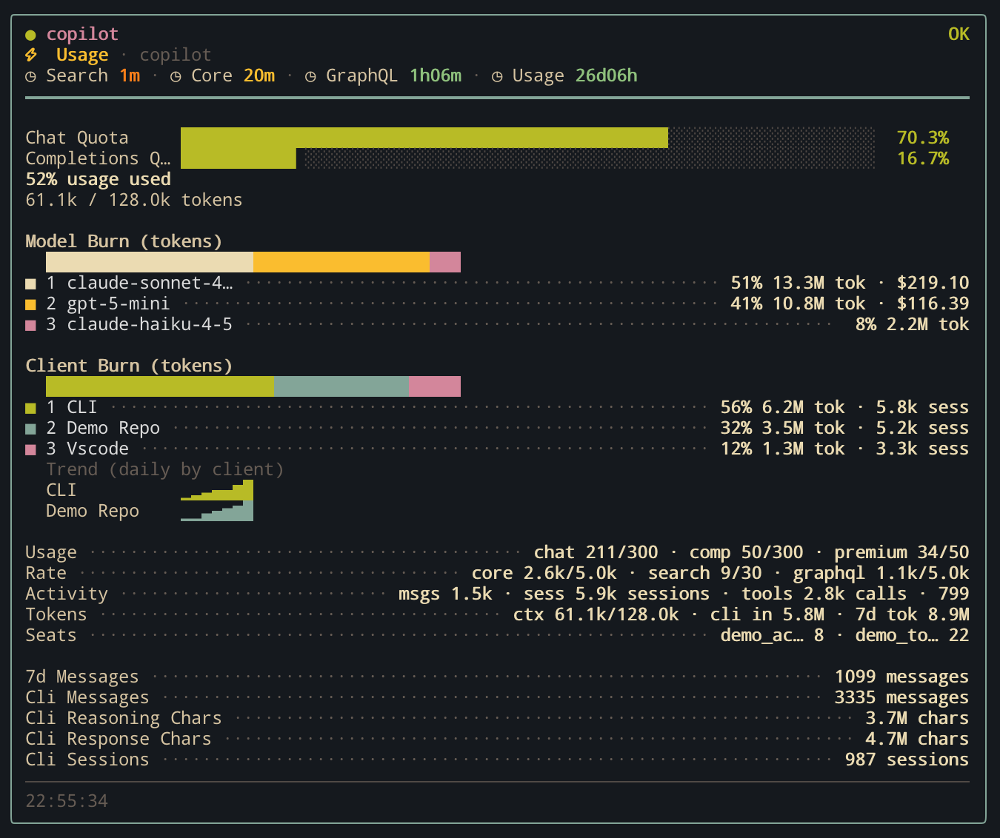
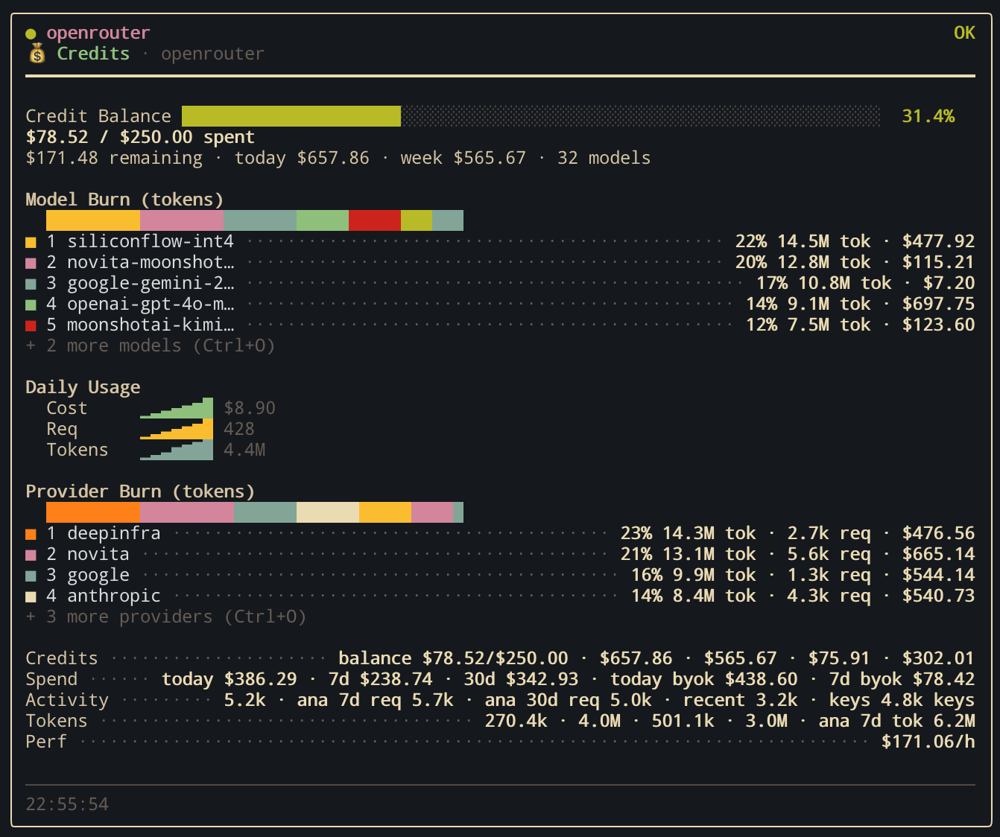

# Providers

OpenUsage ships with 16 provider integrations covering coding agents, API platforms, and local tools. All providers are auto-detected when available — no manual config needed.

## Coding agents & IDEs

### Claude Code

**Detection:** `claude` binary + `~/.claude` directory

Tracks daily activity, per-model token usage, 5-hour billing block computation, burn rate, and cost estimation.

### Cursor

**Detection:** `cursor` binary + local SQLite databases

Tracks plan spend and limits, per-model aggregation, Composer sessions, and AI code scoring. Uses a hybrid approach — API endpoints plus local SQLite DB reads.

### GitHub Copilot

**Detection:** `gh` CLI with Copilot extension installed

Tracks chat and completions quota, org billing, org metrics, and session tracking.

### Codex CLI

**Detection:** `codex` binary + `~/.codex` directory

Tracks session tokens, per-model and per-client breakdown, credits, and rate limits.

### Gemini CLI

**Detection:** `gemini` binary + `~/.gemini` directory

Tracks OAuth status, conversation count, per-model tokens, and quota API data.

### OpenCode

**Detection:** `OPENCODE_API_KEY` or `ZEN_API_KEY` environment variable

Tracks credits, activity, and generation stats via an OpenRouter-compatible API.

### Ollama

**Detection:** `OLLAMA_HOST` environment variable or `ollama` binary

Tracks local server models, per-model usage, and optional cloud billing.

## API platforms

### OpenRouter

**Detection:** `OPENROUTER_API_KEY` environment variable

Tracks credits, activity, generation stats, and per-model breakdown across multiple API endpoints.

### OpenAI

**Detection:** `OPENAI_API_KEY` environment variable

Tracks rate limits via lightweight header probing.

### Anthropic

**Detection:** `ANTHROPIC_API_KEY` environment variable

Tracks rate limits via lightweight header probing.

### Groq

**Detection:** `GROQ_API_KEY` environment variable

Tracks rate limits and daily usage windows.

### Mistral AI

**Detection:** `MISTRAL_API_KEY` environment variable

Tracks subscription info and usage endpoints.

### DeepSeek

**Detection:** `DEEPSEEK_API_KEY` environment variable

Tracks rate limits and account balance.

### xAI (Grok)

**Detection:** `XAI_API_KEY` environment variable

Tracks rate limits and API key info.

### Google Gemini API

**Detection:** `GEMINI_API_KEY` or `GOOGLE_API_KEY` environment variable

Tracks rate limits and per-model limits.

### Alibaba Cloud

**Detection:** `ALIBABA_CLOUD_API_KEY` environment variable

Tracks quotas, credits, daily usage, and per-model tracking.
